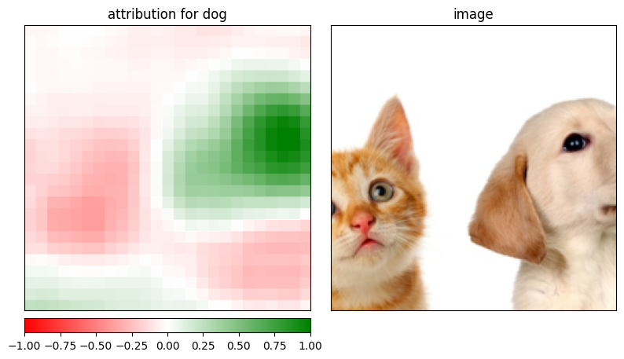
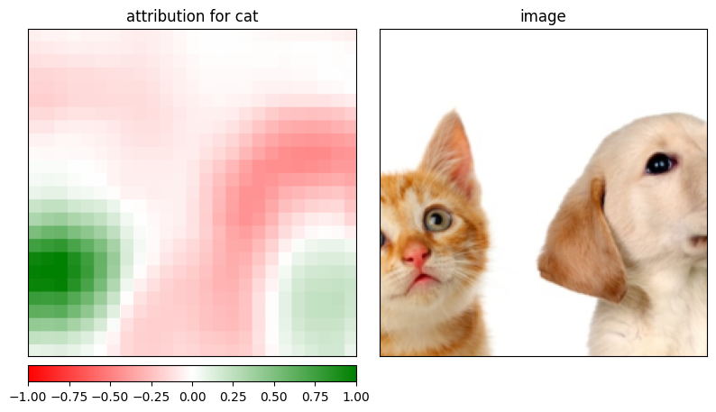

# model_interpretability_using_Captum
I am experimenting with Pytorch Model Interpretability using Captum https://pytorch.org/tutorials/recipes/recipes/Captum_Recipe.html
As you can see in the image below, it works pretty well!

